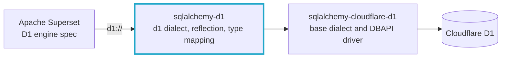

<div align="center">

# Cloudflare D1 for Apache Superset

Connect **Apache Superset** to **Cloudflare D1** with a `d1://` connection string.

[](https://pypi.org/project/sqlalchemy-d1/) [](https://pypi.org/project/sqlalchemy-d1/) [](https://github.com/sqlalchemy-cf-d1/sqlalchemy-d1/actions/workflows/ci.yml) [](https://github.com/sqlalchemy-cf-d1/sqlalchemy-d1/blob/main/LICENSE) [](https://superset.apache.org/user-docs/databases/supported/cloudflare-d1/)

[Quick start](#quick-start) · [Repositories](#repositories) · [How it works](#how-it-works) · [Contributing](#contributing) · [Team](#team)

</div>

<br>

This organization maintains [`sqlalchemy-d1`](https://github.com/sqlalchemy-cf-d1/sqlalchemy-d1), the SQLAlchemy dialect behind the **Cloudflare D1** support in **Apache Superset**. Superset ships the D1 engine spec itself. Since [apache/superset#44505](https://github.com/apache/superset/pull/44505), its `d1` extra installs `sqlalchemy-d1` alone.

## Quick start

You need:

* Your Cloudflare **account ID**
* A Cloudflare [**API token**](https://developers.cloudflare.com/fundamentals/api/get-started/create-token/) with D1 read permission
* Your D1 **database ID**

**1. Install** the dialect in the same environment as Superset. Pick the version that matches the SQLAlchemy version of your Superset.

| Your Superset uses | Install |
|--------------------|---------|
| **SQLAlchemy 2.0** | `pip install "sqlalchemy-d1>=0.2.0"` |
| **SQLAlchemy 1.4** (Superset 6.1.0, for example) | `pip install "sqlalchemy-d1==0.1.0"` |

A plain `pip install sqlalchemy-d1` on SQLAlchemy 1.4 would upgrade SQLAlchemy and break Superset.

**2. Connect.** In Superset, open **Settings > Database Connections > + Database** and use this SQLAlchemy URI:

```
d1://<CF_ACCOUNT_ID>:<CF_API_TOKEN>@<D1_DB_ID>
```

Your tables are listed under the `main` schema.

> [!TIP]
> Not using Superset? Install `sqlalchemy-cloudflare-d1` directly and use its `cloudflare_d1://` connection string.

## Repositories

| Repository | Status | Description |
|------------|--------|-------------|
| [**sqlalchemy-d1**](https://github.com/sqlalchemy-cf-d1/sqlalchemy-d1) | Active | SQLAlchemy dialect for D1. Provides SQLAlchemy compatibility, reflection, and column type mapping. Since 0.2.0 it builds on [sqlalchemy-cloudflare-d1](https://github.com/CollierKing/sqlalchemy-cloudflare-d1) and supports SQLAlchemy 2.0. Published on [PyPI](https://pypi.org/project/sqlalchemy-d1/). |
| [**superset**](https://github.com/sqlalchemy-cf-d1/superset) | Fork | Fork of [apache/superset](https://github.com/apache/superset), used to open pull requests upstream. |
| [**dbapi-d1**](https://github.com/sqlalchemy-cf-d1/dbapi-d1) | Archived | Cloudflare D1 DBAPI 2.0 driver, used by `sqlalchemy-d1` 0.1.0. Replaced by the driver built into sqlalchemy-cloudflare-d1. |
| [**superset-engine-d1**](https://github.com/sqlalchemy-cf-d1/superset-engine-d1) | Archived | Superset EngineSpec for D1. Superset 6.1.0 and newer ship their own D1 engine spec. |
| [**client**](https://github.com/sqlalchemy-cf-d1/client) | Archived | Test client for verifying DBAPI and engine functionality with the 0.1.0 packages. Replaced by the unit and integration tests in `sqlalchemy-d1`. |

## How it works



* The `D1Dialect` in `sqlalchemy-d1` handles schema reflection and type mapping for D1. It reflects dates, booleans and views the way Superset expects.
* Superset ships the D1 engine spec itself, in [`superset/db_engine_specs/d1.py`](https://github.com/apache/superset/blob/master/superset/db_engine_specs/d1.py).
* Since `sqlalchemy-d1` 0.2.0, DBAPI operations come from `sqlalchemy-cloudflare-d1`. Always use **parameterized queries** to avoid injection issues.

The [sqlalchemy-d1 README](https://github.com/sqlalchemy-cf-d1/sqlalchemy-d1#readme) lists everything the dialect adds and its known limits.

## Development

Each repository is independent, uses **Poetry** for dependency management, and contains its own virtual environment. `sqlalchemy-d1` also works with plain pip:

```bash
git clone https://github.com/sqlalchemy-cf-d1/sqlalchemy-d1.git
cd sqlalchemy-d1
python -m venv .venv
source .venv/bin/activate
pip install -e ".[dev]"
pytest -m "not integration" --disable-socket
```

With **Poetry**, run `poetry install --all-extras` instead. The integration tests need a real D1 database. See the [sqlalchemy-d1 README](https://github.com/sqlalchemy-cf-d1/sqlalchemy-d1#development).

The original setup guide for the 0.1.0 stack, with all repositories and a local Superset, is in [SETUP.md](https://github.com/sqlalchemy-cf-d1/.github/blob/main/SETUP.md).

## Contributing

1. Fork the relevant repository.
2. Create a feature branch.
3. Write tests for new functionality.
4. Submit a pull request.

Please follow **PEP8**, **Poetry dependency management**, and Superset coding conventions. In `sqlalchemy-d1`, CI runs `ruff`, `mypy` and the unit tests on every pull request.

Some changes belong in another project:

| Change | Where |
|--------|-------|
| The `d1://` dialect and its reflection | [sqlalchemy-cf-d1/sqlalchemy-d1](https://github.com/sqlalchemy-cf-d1/sqlalchemy-d1) |
| The D1 engine spec in Superset | [apache/superset](https://github.com/apache/superset) |
| The DBAPI driver and base dialect | [CollierKing/sqlalchemy-cloudflare-d1](https://github.com/CollierKing/sqlalchemy-cloudflare-d1) |

## License

All repositories in this organization are licensed under the **Apache License 2.0**. `sqlalchemy-cloudflare-d1` is a separate project under the MIT license.

## Team

For questions or support, open an issue in the relevant repository or reach out to:

<table>
  <tr>
    <td align="center" valign="top" width="140"><a href="https://github.com/ChadRosseau"><br><b>Chad Rossouw</b></a><br><sub>Original author</sub></td>
    <td align="center" valign="top" width="140"><a href="https://github.com/murphylee10"><br><b>Murphy Lee</b></a></td>
    <td align="center" valign="top" width="140"><a href="https://github.com/ThunderRoar"><br><b>Shreyas Rao</b></a></td>
    <td align="center" valign="top" width="140"><a href="https://github.com/danielalyoshin"><br><b>Daniel Alyoshin</b></a><br><sub>Lead maintainer</sub></td>
    <td align="center" valign="top" width="140"><a href="https://github.com/alan-zhang39"><br><b>Alan Zhang</b></a></td>
  </tr>
</table>
